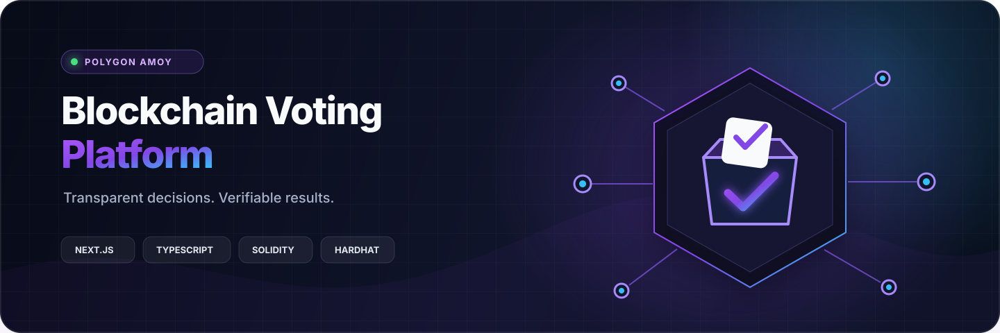
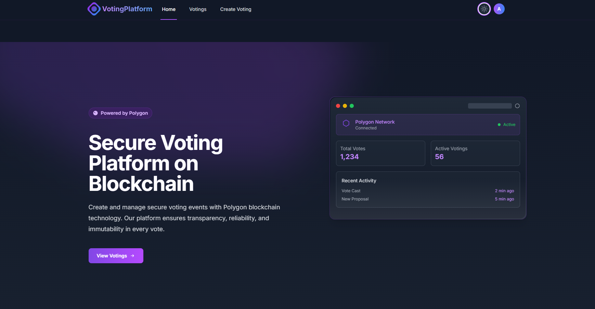
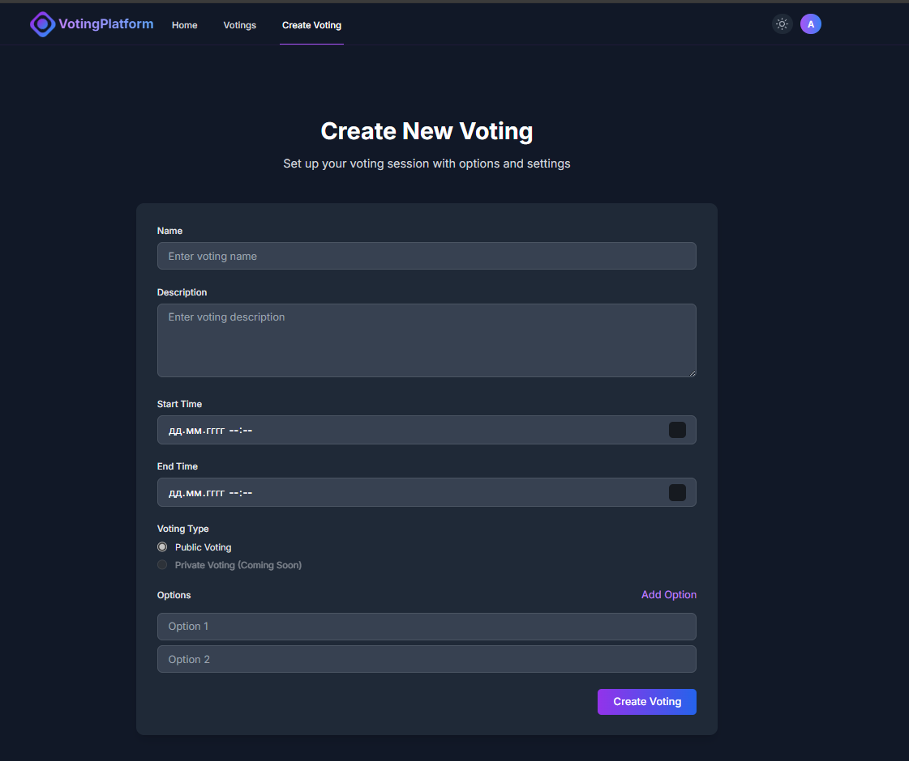
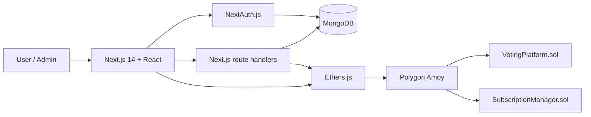

<div align="center">
  
</div>

<div align="center">
  <br />
  <a href="https://nextjs.org/"></a>
  <a href="https://www.typescriptlang.org/"></a>
  <a href="https://soliditylang.org/"></a>
  <a href="https://polygon.technology/"></a>
  <a href="https://hardhat.org/"></a>
  <a href="https://www.mongodb.com/"></a>
</div>

<p align="center">
  A full-stack decentralized voting application for creating, managing, and participating in transparent voting sessions on the Polygon Amoy testnet.
</p>

<p align="center">
  <a href="#highlights">Highlights</a> ·
  <a href="#interface">Interface</a> ·
  <a href="#architecture">Architecture</a> ·
  <a href="#quick-start">Quick start</a> ·
  <a href="#configuration">Configuration</a> ·
  <a href="#security">Security</a>
</p>

---

## Overview

Blockchain Voting Platform combines a modern Next.js interface with Solidity smart contracts. Users can connect a wallet, join public or restricted voting sessions, and inspect results, while administrators manage users, sessions, subscriptions, and platform tokens from a dedicated dashboard.

The application integrates with Polygon Amoy for voting transactions and uses NextAuth.js with MongoDB for accounts, sessions, and application metadata.

## Interface

<div align="center">
  
</div>

<details>
  <summary><strong>View the voting creation screen</strong></summary>
  <br />
  <div align="center">
    
  </div>
</details>

## Highlights

| | Capability | What it provides |
|---|---|---|
| 🔗 | **Blockchain-backed voting** | Solidity contracts and Ethers.js integration on Polygon Amoy |
| 🗳️ | **Flexible sessions** | Public and restricted votings with configurable options and time windows |
| 👛 | **Wallet integration** | Browser wallet connection and network-aware Web3 flows |
| 🔐 | **Account security** | NextAuth sessions, role checks, and protected API routes |
| 🎟️ | **Subscription access** | Activation, status checks, cancellation, and gated capabilities |
| 🛠️ | **Administration** | Management tools for users, votings, subscriptions, and tokens |
| 🌗 | **Responsive interface** | Animated layouts with light and dark theme support |

## Architecture



### Technology stack

| Layer | Technologies |
|---|---|
| Web application | Next.js, React, TypeScript, Tailwind CSS, Framer Motion |
| Authentication and data | NextAuth.js, MongoDB, bcrypt |
| Web3 | Ethers.js, Polygon Amoy, browser wallet providers |
| Smart contracts | Solidity, OpenZeppelin Contracts |
| Development and tests | Hardhat, Chai, Jest, Testing Library |

## Project structure

```text
.
├── contracts/               # Solidity smart contracts
├── ignition/modules/        # Hardhat Ignition modules
├── test/                    # Smart-contract tests
├── front/
│   ├── app/                 # Next.js pages, components, and route handlers
│   ├── components/          # Shared React components
│   ├── contracts/           # Frontend contract artifacts
│   ├── lib/                 # Auth, database, and blockchain helpers
│   └── public/              # Static assets
├── .env.example             # Contract tooling configuration template
└── hardhat.config.js        # Solidity compiler and Amoy network setup
```

## Quick start

### Prerequisites

- Node.js 18 or newer
- npm
- A MongoDB database
- A Polygon Amoy RPC endpoint
- A funded Amoy test wallet for contract operations

### 1. Clone and install the contract workspace

```bash
git clone https://github.com/Koshkxrov/blockchain-voting-platform.git
cd blockchain-voting-platform
npm ci
```

Copy `.env.example` to `.env`, then replace every placeholder with your own testnet configuration.

```bash
npx hardhat compile
npm test
```

### 2. Install and run the web application

```bash
cd front
npm ci
```

Copy `.env.local.example` to `.env.local`, configure the required services, and start the development server:

```bash
npm run dev
```

Open [http://localhost:3000](http://localhost:3000).

## Configuration

The repository contains safe templates for both environments. Do not put real credentials in tracked files.

### Contract workspace — `.env`

| Variable | Purpose |
|---|---|
| `AMOY_RPC_URL` | Polygon Amoy JSON-RPC endpoint |
| `PRIVATE_KEY` | Testnet deployer wallet key |
| `NEXT_PUBLIC_CONTRACT_ADDRESS` | Deployed voting contract address |
| `NEXT_PUBLIC_RPC_URL` | Public RPC endpoint used by clients |

### Web application — `front/.env.local`

| Group | Variables |
|---|---|
| Database | `MONGODB_URI`, `MONGODB_DB` |
| Authentication | `NEXTAUTH_SECRET`, `JWT_SECRET`, `NEXTAUTH_URL` |
| Blockchain | `NEXT_PUBLIC_RPC_URL`, `NEXT_PRIVATE_RPC_URL`, `NEXT_PUBLIC_CONTRACT_ADDRESS` |
| Administration | `ADMIN_ADDRESS`, `ADMIN_EMAIL`, `ADMIN_PASSWORD`, `ADMIN_PRIVATE_KEY` |
| Application | `NEXT_PUBLIC_APP_URL`, `SUBSCRIPTION_CODE` |

See [`.env.example`](./.env.example) and [`front/.env.local.example`](./front/.env.local.example) for the complete templates.

## Useful commands

| Location | Command | Purpose |
|---|---|---|
| Repository root | `npx hardhat compile` | Compile the smart contracts |
| Repository root | `npm test` | Run the Hardhat contract tests |
| `front/` | `npm run dev` | Start the local Next.js server |
| `front/` | `npm run build` | Create a production frontend build |
| `front/` | `npm run start` | Serve the production build |

## Security

> [!IMPORTANT]
> This project targets a test network. Review and audit the contracts before adapting the platform for production or real-world elections.

- Never commit `.env` or `.env.local` files.
- Use dedicated test wallets and rotate any exposed credentials immediately.
- Keep private RPC endpoints, database credentials, authentication secrets, and subscription codes outside version control.
- Validate contract addresses and the active chain before signing transactions.

## Current scope

This repository includes the application, API routes, contract sources, and local development configuration. Generated build output, installed dependencies, and private environment files are intentionally excluded from Git.

---

<p align="center">
  Built with Next.js, Solidity, and Polygon.
</p>
